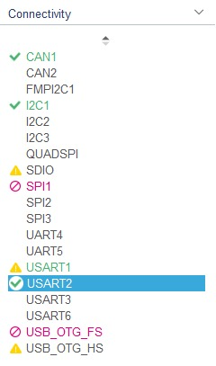
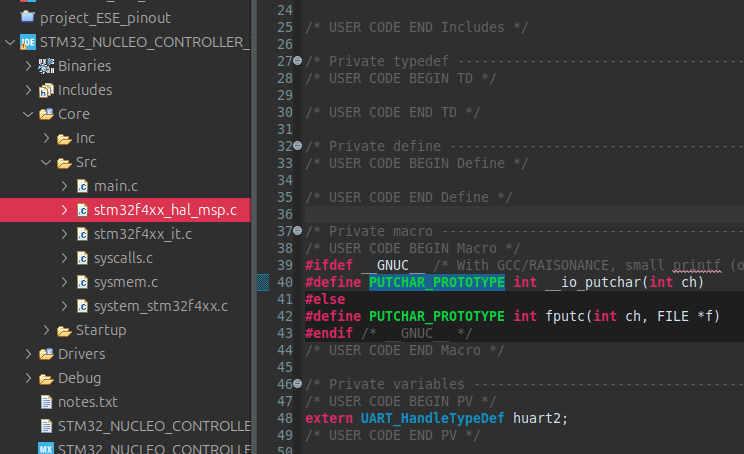
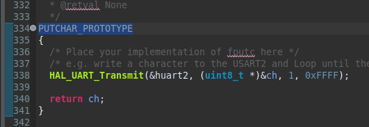

# TP1 – Bus I²C  

## 2.1 Capteur BMP280
###  Objectif  
Identifier et utiliser les registres essentiels du capteur BMP280 en mode I²C, lire les données brutes pression/température et appliquer les formules de compensation officielles de Bosch.

---

##  1. Adresses I²C possibles  
Le BMP280 propose deux adresses I²C selon la broche SDO :

| SDO | Adresse I²C (7 bits) |
|-----|-----------------------|
| GND | 0x76 |
| VDDIO | 0x77 |

Voir le shematic Grove - IMU 10DOF v2.0 & datasheet BMP280 section I²C Interface, page 28 : 

[Grove - IMU 10DOF v2.0 Sch.pdf](./docs/Grove-IMU_10DOF_v2.0_Sch.pdf)
[BMP280_Datasheet.pdf](./docs/BMP280_Datasheet.pdf)


---

## 2. Registre d’identification  
- Adresse du registre : **0xD0**  
- Valeur retournée : **0x58**

Voir datasheet BMP280 section Register Description, page 24 : [BMP280_Datasheet.pdf](./docs/BMP280_Datasheet.pdf)


---

## 3. Configuration du mode NORMAL  
Le registre **CTRL_MEAS (0xF4)** contrôle :
- **osrs_t** (bits 7:5) : oversampling température  
- **osrs_p** (bits 4:2) : oversampling pression  
- **mode** (bits 1:0)

Mode Normal → **mode = 11**

Configuration utilisée dans le TP :  
- osrs_t = `010`  
- osrs_p = `101`  
- mode   = `11`

→ Valeur à écrire dans **0xF4 = 0x57**

Voir datasheet BMP280 section Power modes, page 15 : [BMP280_Datasheet.pdf](./docs/BMP280_Datasheet.pdf)


---

## 4. Registres d’étalonnage (calibration)  
Les coefficients dig_T1..T3 et dig_P1..P9 sont stockés dans :

- **0x88 → 0xA1**

Liste officielle :

| Adresse | Nom |
|---------|------|
| 0x88–0x89 | dig_T1 |
| 0x8A–0x8B | dig_T2 |
| 0x8C–0x8D | dig_T3 |
| 0x8E–0x8F | dig_P1 |
| 0x90–0x9F | dig_P2 à dig_P9 |
  

Voir datasheet BMP280 section Memory map, page 24 & Trimming parameter readout, page 21: [BMP280_Datasheet.pdf](./docs/BMP280_Datasheet.pdf)


---

## 5. Registres de température (20 bits)

| Registre | Description |
|----------|-------------|
| 0xFA | temp_msb (bits 19:12) |
| 0xFB | temp_lsb (bits 11:4) |
| 0xFC | temp_xlsb (bits 3:0) |

Format : **20 bits non signés**

Voir datasheet BMP280 section Register 0xFA–0xFC, page 27 & section Data readout, page 19 : [BMP280_Datasheet.pdf](./docs/BMP280_Datasheet.pdf)


---

## 6. Registres de pression (20 bits)

| Registre | Description |
|----------|-------------|
| 0xF7 | press_msb |
| 0xF8 | press_lsb |
| 0xF9 | press_xlsb |

Format : **20 bits non signés**

Voir datasheet BMP280 section Register 0xF7–0xF9, page 26 & section Data readout, page 19 : [BMP280_Datasheet.pdf](./docs/BMP280_Datasheet.pdf)


---

## 7. Fonctions de compensation (format int32 / int64)

Bosch fournit les fonctions officielles :


**Température compensée (int32):**
```c
BMP280_S32_t bmp280_compensate_T_int32(BMP280_S32_t adc_T);
```
**Pression compensée (int64) ou (int32):**
```c
BMP280_U32_t bmp280_compensate_P_int64(BMP280_S32_t adc_P);
```


Les formules officielles sont dans la datasheet, section 3.11.3.

Voir datasheet BMP280 section Compensation formula, page 21 : [BMP280_Datasheet.pdf](./docs/BMP280_Datasheet.pdf)


---

## 2.2 – Setup du STM32

### 🎯 Objectif
Configurer le STM32 pour :
- Initialiser les périphériques nécessaires (I²C, UART2, CAN)
- Permettre la communication UART → USB (ST-Link)
- Rediriger `printf()` vers l’UART pour faciliter les tests et le débogage
- Vérifier la configuration via STM32CubeIDE (IOC) et via le terminal série

---

### Configuration matérielle (CubeMX / .IOC)

La carte Grove IMU 10DOF v2.0 utilise un BMP280 connecté en I²C.  
Voir le shematic Grove - IMU 10DOF v2.0 : 

[Grove - IMU 10DOF v2.0 Sch.pdf](./docs/Grove-IMU_10DOF_v2.0_Sch.pdf)

####  Configuration CubeMX
Voici la configuration utilisée dans le fichier `.ioc` :




UART2 est configuré en mode **Asynchronous** à **115200 bauds**, ce qui permet de rediriger `printf()` vers le terminal USB-STLink.

---

### Redirection du printf() vers l’UART




Teste de ce printf avec un programme de type echo.

```c
	/* USER CODE BEGIN 2 */

	printf("=== Test UART2 Echo ===\r\n");
	printf("Tapez quelque chose...\r\n");

	uint8_t rx_char;
	/* USER CODE END 2 */

	/* Infinite loop */
	/* USER CODE BEGIN WHILE */
	while (1)
	{
		if (HAL_UART_Receive(&huart2, &rx_char, 1, HAL_MAX_DELAY) == HAL_OK)
		{
			HAL_UART_Transmit(&huart2, &rx_char, 1, HAL_MAX_DELAY);
			//printf("%c", rx_char);
		}
		/* USER CODE END WHILE */
```


####  Pourquoi dans stm32f4xx_hal_msp.c ?
Sur un STM32 :
- Le fichier MSP est le bon endroit pour mettre les fonctions de bas niveau utilisées par HAL
- Il est chargé avant le main, donc printf fonctionne dès le début
- Il n’est pas écrasé par CubeMX contrairement à main.c
- La HAL appelle automatiquement les fonctions MSP grâce au faible linkage (__weak)

---

# 2.3 Communication avec le BMP280

## 2.3.1 – Identification du BMP280

### 🎯 Objectif

Lire le registre **ID (0xD0)** du BMP280 en mode I²C et vérifier que la valeur retournée correspond bien à celle indiquée dans la datasheet (**0x58**).

---

### 📌 Adresse et registre utilisés

Dans le code, l’adresse I²C et le registre d’identification sont définis comme suit :

```c
#define BMP280_I2C_ADDR   (0x77 << 1)   // Adresse 7 bits = 0x77
#define BMP280_REG_ID     0xD0          // Registre d'identification
```

Comme indiqué précédemment (section *Registre d’identification*, Figure 02), la valeur attendue est **0x58**.

---

### 🔍 Procédure de lecture I²C

La lecture d’un registre via la HAL du STM32 se fait avec :

```c
HAL_I2C_Mem_Read(&hi2c1,
			BMP280_I2C_ADDR,      // (0x77 << 1)
			BMP280_REG_ID,        // 0xD0
			I2C_MEMADD_SIZE_8BIT,
			&id,
			1,
			HAL_MAX_DELAY)
```

Étapes I²C correspondantes :

1. Envoi de l’adresse du registre (**0xD0**)
2. Lecture d’un octet
3. Vérification de la valeur retournée (doit être **0x58**)

---

### 🖥️ Résultat côté terminal

Une fois la lecture réalisée, le terminal affiche :

```
=== Test BMP280: lecture ID ===
BMP280 ID = 0x58
Identification OK (0x58 attendu)
```

Ce qui confirme que le capteur BMP280 est correctement détecté sur le bus I²C.

---

### 📡 Vérification à l’oscilloscope

La trame I²C observée correspond bien au schéma suivant :

* Start condition
* Adresse 0x77 + bit R/W
* Envoi du registre 0xD0
* Redémarrage (Repeated START)
* Lecture du byte 0x58
* Stop condition

👉 Cf. capture d’écran :


---

## 2.3.2 – Configuration du BMP280

### 🎯 Objectif

Passer le BMP280 en **mode NORMAL**, avec :

* **Temperature oversampling = ×2**
* **Pressure oversampling = ×16**
* **Mode = Normal**

---

### 📌 Registre utilisé : CTRL_MEAS (0xF4)

Conformément à la section précédente du README (Figure 03), le registre CTRL_MEAS contient :

| Bits | Champ  | Description              |
| ---- | ------ | ------------------------ |
| 7:5  | osrs_t | Oversampling température |
| 4:2  | osrs_p | Oversampling pression    |
| 1:0  | mode   | Mode d’alimentation      |

Configuration demandée :

* osrs_t = `010` (×2)
* osrs_p = `101` (×16)
* mode   = `11`  (normal mode)

Ce qui donne :

```
0b01010111 = 0x57
```

---

### 📝 Écriture I²C dans CTRL_MEAS

L’écriture du registre s’effectue avec :

```c
// mode normal, osrs_p x16, osrs_t x2
value = 0x57;  // 010 101 11

ret = HAL_I2C_Mem_Write(&hi2c1,
		BMP280_I2C_ADDR,
		BMP280_REG_CTRL_MEAS,
		I2C_MEMADD_SIZE_8BIT,
		&value,
		1,
		HAL_MAX_DELAY);
```

---

### 🔄 Vérification de la configuration

Après l’écriture, une lecture du même registre est réalisée :

```c
ret = HAL_I2C_Mem_Read(&hi2c1,
			BMP280_I2C_ADDR,
			BMP280_REG_CTRL_MEAS,
			I2C_MEMADD_SIZE_8BIT,
			&readback,
			1,
			HAL_MAX_DELAY);
            
printf("CTRL_MEAS ecrit = 0x%02X, lu = 0x%02X\r\n", value, readback);

	if (readback == value)
	{
		printf("Configuration BMP280 OK\r\n");
	}
	else
	{
		printf("Configuration BMP280 INCORRECTE\r\n");
	}
```

Résultat attendu dans le terminal :

```
Configuration BMP280 OK
```

---

### 🖥️ Affichage terminal et capture

Voir la capture suivante montrant :

* Le registre ID correctement lu
* Le registre CTRL_MEAS configuré et confirmé


