# TP Bus & Réseaux – TP1 à TP5

### I²C – UART – REST – CAN

**ENSEA – 2526-S9-ESE**

**Auteurs :**

* Houssam HAKKI
* João Pedro PENELU

---

## 1. Présentation générale

L’objectif de cette série de travaux pratiques est de mettre en œuvre une **chaîne complète de communication embarquée**, depuis l’acquisition capteur jusqu’à l’exposition réseau, en combinant plusieurs bus industriels et protocoles logiciels.

L’architecture globale demandée est la suivante :

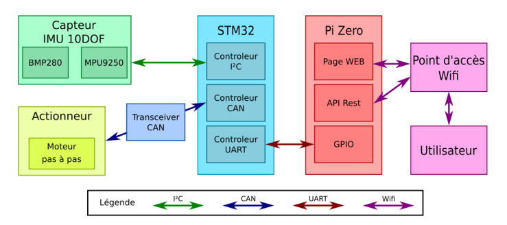

Les développements sont réalisés :
* en **C** pour la partie STM32 (HAL),
* en **Python** pour la partie Raspberry Pi (pyserial, Flask/FastAPI).

Cette organisation correspond exactement au cahier des charges du module *Bus et Réseaux Industriels*.

---
## 2. TP1 – Bus I²C : Interfaçage des capteurs

### 2.1 Capteur BMP280
#### Objectif
Identifier et utiliser les registres essentiels du capteur BMP280 en mode I²C, lire les données brutes pression/température et appliquer les formules de compensation officielles de Bosch.

---

#### Adresses I²C possibles
Le BMP280 propose deux adresses I²C selon la broche SDO :

| SDO | Adresse I²C (7 bits) |
|-----|-----------------------|
| GND | `0x76` |
| VDDIO | `0x77` |

Dans notre montage (IMU Grove 10DOF v2.0), l’adresse utilisée est `0x77`.


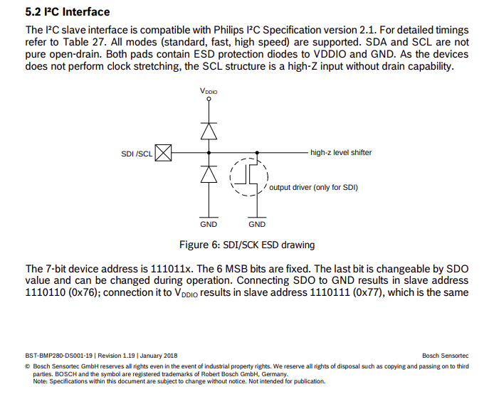

---

#### Registre d’identification
- Adresse du registre : **0xD0**
- Valeur retournée : **0x58**

La lecture correcte de ce registre valide la présence du BMP280 sur le bus I²C.

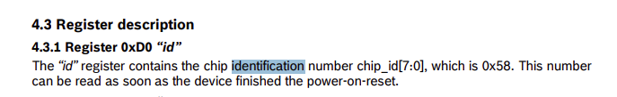

---

#### Configuration du mode NORMAL
Le registre **CTRL_MEAS (0xF4)** contrôle :
- **osrs_t** (bits 7:5) : oversampling température
- **osrs_p** (bits 4:2) : oversampling pression
- **mode** (bits 1:0)

Configuration utilisée :
- osrs_t = `010` (×2)
- osrs_p = `101` (×16)
- mode   = `11` (Normal)

→ Valeur à écrire dans **0xF4 = `0x57`**

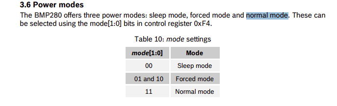

---

#### Registres d’étalonnage (calibration)
Les coefficients d’étalonnage (`dig_T1`..`T3`, `dig_P1`..`P9`) sont stockés dans les registres `0x88` à `0xA1`. Ils sont lus une seule fois au démarrage et utilisés pour les calculs de compensation.

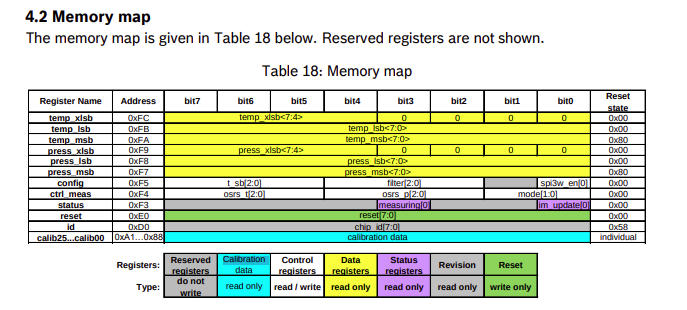
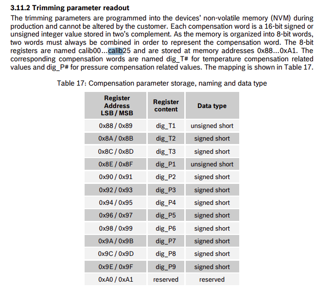

---

#### Registres de données et Fonctions de compensation
- **Température** : Données brutes sur 20 bits dans les registres `0xFA`–`0xFC`.
- **Pression** : Données brutes sur 20 bits dans les registres `0xF7`–`0xF9`.

Bosch fournit les fonctions officielles pour convertir ces valeurs brutes en valeurs physiques (en °C et Pa).
```c
BMP280_S32_t bmp280_compensate_T_int32(BMP280_S32_t adc_T);
BMP280_U32_t bmp280_compensate_P_int32(BMP280_S32_t adc_P);
```
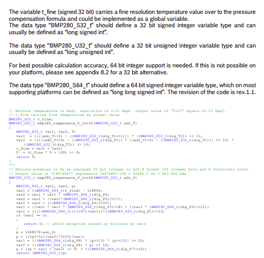

### 2.2 Configuration du STM32
#### Objectif
Configurer le STM32 pour communiquer avec les capteurs I²C, établir la liaison UART avec le Raspberry Pi, et faciliter le debug via `printf()` redirigé sur l’UART USB.

#### Configuration matérielle (CubeMX)
Les périphériques suivants sont configurés :
- I²C : pour les capteurs BMP280 / IMU
- UART2 : pour le debug via le port USB ST-Link (115200 bauds)
- UARTx : pour la liaison avec le Raspberry Pi
- CAN : pour le TP4

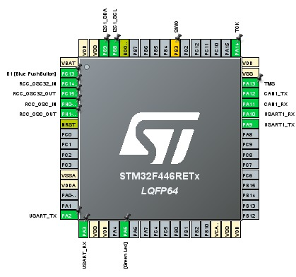

#### Redirection du `printf()`
La redirection est réalisée dans `stm32f4xx_hal_msp.c` en implémentant `__io_putchar`. Ceci garantit que `printf()` est fonctionnel dès le démarrage pour le débogage.

```c
// Fichier stm32f4xx_hal_msp.c
PUTCHAR_PROTOTYPE
{
  HAL_UART_Transmit(&huart2, (uint8_t *)&ch, 1, 0xFFFF);
  return ch;
}
```
Un test avec un programme d'écho a validé la configuration.


### 2.3 Communication I²C et Validation
Les fonctions HAL (`HAL_I2C_Mem_Read`, `HAL_I2C_Mem_Write`) sont utilisées pour communiquer avec le BMP280.

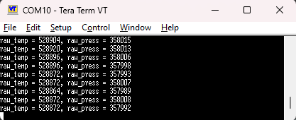

#### Identification et Configuration
La lecture du registre ID (`0xD0`) a bien retourné `0x58`. L'écriture de `0x57` dans `CTRL_MEAS` (`0xF4`) a été confirmée par relecture.

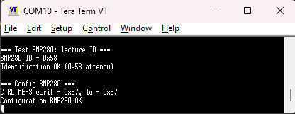

#### Vérification à l’oscilloscope
Les trames I²C ont été vérifiées à l’oscilloscope, confirmant la conformité des signaux (START, adresse, data, ACK, STOP).

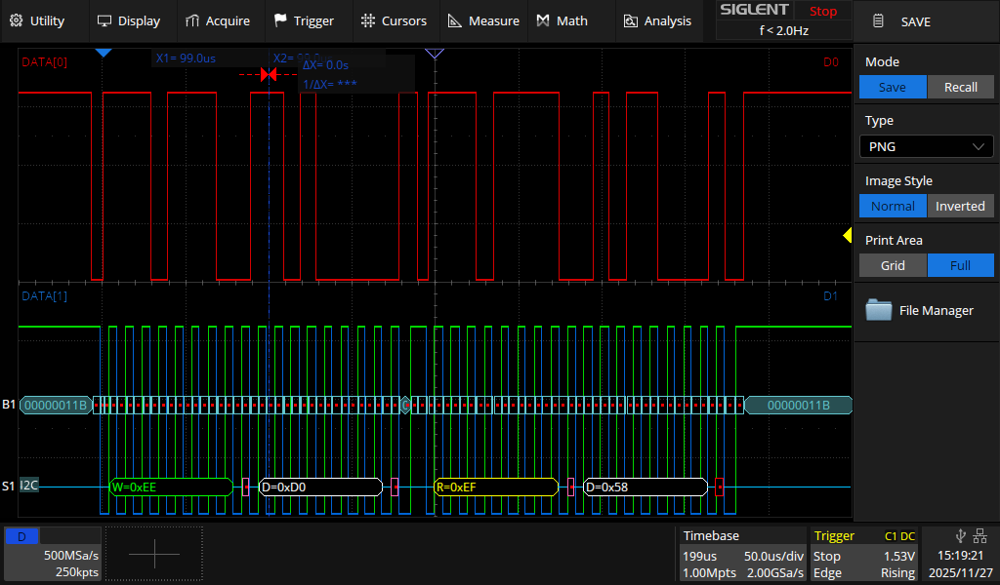
### 2.4 Communication I²C et Validation
Communication avec le capteur MPU9250
La communication avec le capteur MPU9250 a été mise en œuvre avec succès via le bus I²C.
Le STM32 est capable de :
- identifier correctement le composant,
- configurer ses registres internes,
- lire les données brutes issues de l’accéléromètre et du gyroscope.
Les échanges I²C ont été vérifiés et validés, ce qui confirme le bon fonctionnement du bus et du driver logiciel associé.
Cependant, le calcul de la position ou de l’orientation à partir des mesures du MPU9250 n’a pas été implémenté dans ce TP.
Cette étape nécessite en effet des algorithmes de fusion de capteurs (filtrage complémentaire ou filtre de Kalman), qui dépassent le cadre de ce travail pratique.
Les données brutes restent néanmoins disponibles et pourront être exploitées ultérieurement pour le calcul d’angles ou de trajectoires.

[mpu9250.c](FIRMWARE/STM32_NUCLEO_CONTROLLER/COM_drivers/sensors/mpu9250.c)

---
## 3. TP2 – STM32 ↔ Raspberry Pi (UART)

### 3.1 Mise en route du Raspberry Pi Zero
Le Raspberry Pi est configuré avec :
* Raspberry Pi OS Lite
* SSH activé pour l'accès à distance
* UART matériel activé sur le port GPIO
* Python 3 et pip pour l'installation des dépendances

### 3.2 Protocole série STM32 ↔ RPi
Le protocole implémenté est textuel et synchrone. Le Raspberry Pi envoie une commande terminée par `\r\n` et attend une réponse.

| Commande     | Réponse STM32 | Description                  |
| ------------ | ------------- | ---------------------------- |
| `GET_T`      | `T=+24.91_C`  | Lire la température          |
| `GET_P`      | `P=102300Pa`  | Lire la pression             |
| `GET_K`      | `K=10.00000`  | Lire le coefficient K        |
| `SET_K=1234` | `SET_K=OK`    | Modifier K (valeur × 100)    |
| `GET_A`      | `A=125.7000`  | Lire la valeur de l'angle    |

Les échanges sont d'abord testés manuellement via **minicom** puis automatisés.

### 3.3 Client Python (`stm32_client_v3.py`)
Un script client a été développé en Python pour valider la communication série avant l'intégration REST. Il fournit une interface en ligne de commande pour envoyer des commandes au STM32 et parser les réponses.

* **Rôle** : Isoler et tester la couche de communication matérielle.
* **Fonctionnalités** :
  * Ouvre et configure le port série (`/dev/ttyAMA0` @ 115200 bauds).
  * Encapsule chaque commande du protocole dans une fonction Python (ex: `get_temperature()`).
  * Gère les timeouts et le parsing des réponses textuelles.

Extrait du menu interactif du client :
```python
# stm32_client_v3.py
def main():
    # ... (ouverture du port série) ...
    try:
        while True:
            print("=== Menu STM32 ===")
            print("1) Lire température")
            print("2) Lire pression")
            # ...
            choice = input("> ").strip()
            # ... (logique de menu) ...
    # ...
```
Ce script a permis de valider que la liaison UART et le protocole étaient robustes.

### 3.4 Implémentation du client série Python
Le script `stm32_client_v3.py` est au cœur de la communication côté Raspberry Pi. Il est conçu pour être robuste et gère l'envoi de commandes et l'analyse des réponses.

#### Envoi de commande et gestion du timeout
La fonction `send_command` gère la communication de bas niveau.

```python
# stm32_client_v3.py
def send_command(ser, cmd: str) -> str:
    """
    Envoie une commande (sans \r\n) au STM32 et lit la réponse.
    """
    # 1. Vider le buffer de réception pour éviter de lire des données anciennes
    ser.reset_input_buffer()

    # 2. Envoyer la commande formatée avec "\r\n"
    line = (cmd + "\r\n").encode("ascii")
    ser.write(line)
    ser.flush() # S'assurer que les données sont bien parties sur le port

    # 3. Lecture de la réponse avec un timeout pour ne pas bloquer indéfiniment
    deadline = time.time() + TIMEOUT_S
    buf = bytearray()
    while time.time() < deadline:
        if ser.in_waiting:
            b = ser.read(1)
            if not b or b in (b"\r", b"\n"):
                break
            buf += b
        else:
            time.sleep(0.01)

    # 4. Décodage et nettoyage de la réponse
    resp = buf.decode("ascii", errors="ignore").strip()
    return resp
```
**Explication :**
1.  Le buffer d'entrée est vidé avant chaque envoi pour garantir que la réponse lue correspond bien à la commande envoyée.
2.  La commande est encodée en `ascii` et terminée par `\r\n`, simulant l'envoi via un terminal série comme minicom.
3.  Une boucle avec `timeout` lit la réponse octet par octet jusqu'à recevoir un retour à la ligne (`\r` ou `\n`), évitant de bloquer le script si le STM32 ne répond pas.
4.  La réponse brute est décodée en chaîne de caractères et les espaces superflus sont retirés.

#### Analyse des réponses (`_parse_value`)
Cette fonction est conçue pour extraire la valeur numérique des réponses textuelles du STM32, qui peuvent avoir des formats variés.

```python
# stm32_client_v3.py
def _parse_value(resp: str, prefix: str):
    # ...
    # Cas où on reçoit juste un nombre
    tail = resp.strip()

    # Si ça se termine par 'H' → interpréter comme hexa brut (20 bits)
    if tail.endswith('H'):
        hex_str = tail[:-1]
        return int(hex_str, 16)

    # Sinon, extraire juste le nombre au début (chiffres, signe, point)
    num = ""
    for ch in tail:
        if ch.isdigit() or ch in "+-.":
            num += ch
        else:
            break
    # ...
    # Si il y a un point, on renvoie float, sinon int
    if "." in num:
        return float(num)
    else:
        return int(num)
```
**Explication :** Cette fonction analyse la chaîne de caractères (ex: `T=+24.91_C`) pour n'en extraire que la partie numérique (`+24.91`), qu'elle convertit ensuite en `float` ou en `int` selon le format. Elle gère aussi les cas où la valeur est en hexadécimal.

---
## 4. TP3 – Interface REST

### 4.1 Principe REST et CRUD
Une API REST (REpresentational State Transfer) repose sur :
* des **routes** claires (ex: `/api/temp/`),
* des **méthodes HTTP** standard (`GET`, `POST`, `DELETE`),
* des **réponses JSON** structurées,
* des codes de statut HTTP explicites (200, 404, etc.).

Les opérations suivent le principe **CRUD** (Create, Read, Update, Delete).

### 4.2 Implémentation avec Flask (Première approche)
Le serveur a d'abord été implémenté avec **Flask** pour créer une base fonctionnelle. L'architecture utilisait des **Blueprints** pour organiser les routes de l'API.

#### Structure du code Flask
Le code est réparti en deux fichiers principaux :
1.  `app.py` : Crée l'application Flask, enregistre le Blueprint et gère les erreurs globales (404, 500).
2.  `api/__init__.py` : Définit le Blueprint `api_bp` et contient les routes spécifiques de l'API.

```python
# api/__init__.py : Exemple de route simple avec Flask
from flask import Blueprint, jsonify

api_bp = Blueprint("api", __name__)
welcome = "Welcome to 3ESE API!"

@api_bp.route("/welcome/<int:index>")
def api_welcome_index(index):
    """
    Retourne un caractère précis.
    Gestion d'erreur si l'index est hors limites.
    """
    try:
        # Accès direct à la chaîne et retour JSON
        return jsonify({
            "index": index,
            "val": welcome[index]
        })
    except IndexError:
        # Réponse d'erreur manuelle en cas d'échec
        return jsonify({
            "error": "index out of range",
        }), 400
```
**Explication :**
-   Un `Blueprint` permet de modulariser une application Flask. Ici, toutes les routes de l'API sont préfixées par `/api`.
-   La route `/welcome/<int:index>` capture un entier depuis l'URL.
-   La gestion d'erreur est manuelle avec un bloc `try...except`. En cas d'`IndexError`, une réponse JSON avec un code de statut `400 Bad Request` est construite et retournée. Cette gestion manuelle est l'une des raisons pour lesquelles FastAPI, avec sa validation automatique, est plus adapté.

### 4.3 Evolution vers FastAPI
Suite à cette première version, le serveur a été réécrit en **FastAPI** pour bénéficier de ses avantages :
* **Performance** : FastAPI est nativement asynchrone (ASGI) et plus rapide que Flask (WSGI).
* **Validation des données** : Utilisation de Pydantic pour valider automatiquement les types des requêtes et réponses.
* **Documentation automatique** : Génération d'une interface interactive (Swagger UI sur `/docs`) qui simplifie les tests et la documentation.
* **Code concis** : Syntaxe plus moderne et moins verbeuse pour les API.

---
## 5. TP4 – Bus CAN

### Objectif
Piloter un moteur pas-à-pas via le bus CAN, en utilisant un transceiver TJA1050. Le STM32 initialise le contrôleur CAN, envoie des trames CAN standard et ajuste l’angle moteur proportionnellement à une valeur de capteur. La vitesse du bus a été réglée à **500 kbit/s** pour être compatible avec la carte moteur.

### 5.1 Détails de l'implémentation CAN
Pour piloter le moteur, le STM32 envoie des trames sur le bus CAN. La bibliothèque HAL de ST facilite la construction de ces trames.

#### Structure de la trame CAN
La trame est définie à l'aide de la structure `CAN_TxHeaderTypeDef`.

```c
static HAL_StatusTypeDef StepperCAN_SendStd(uint16_t std_id,
                                            const uint8_t *data,
                                            uint8_t dlc)
{
    CAN_TxHeaderTypeDef txh;
    uint32_t tx_mailbox;
    txh.StdId = std_id;
    txh.ExtId = 0;
    txh.IDE   = CAN_ID_STD;
    txh.RTR   = CAN_RTR_DATA;
    txh.DLC   = dlc;
    txh.TransmitGlobalTime = DISABLE;
    return HAL_CAN_AddTxMessage(&hcan1, &txh, (uint8_t*)data, &tx_mailbox);
}
```
**Explication des champs :**
?????
- `StdId`: L'identifiant standard du message sur 11 bits. C'est ce qui permet au bon nœud (le moteur) de reconnaître le message qui lui est destiné.
- `IDE`: Indique si l'ID est standard (11 bits) ou étendu (29 bits).
- `RTR`: Définit si la trame transporte des données (`CAN_RTR_DATA`) ou si c'est une "Remote Transmission Request" pour demander des données.
- `DLC` (Data Length Code): Le nombre d'octets de données utiles dans la trame (de 0 à 8).

#### Contenu de la trame (payload)
main:

```c
printf("\r\n=== Init CAN (500 kbit/s) ===\r\n");
	if (StepperCAN_Init(&hcan1) != HAL_OK)
	{
		printf("Erreur init CAN\r\n");
	}
	else
	{
		StepperCAN_SetBaseId(STEPPER_CAN_BASE_0x60);
		/* IMPORTANT :
		 * Réinitialisation de la position moteur au démarrage
		 */
		StepperCAN_SetZero();
		HAL_Delay(200);  /* laisse le temps à la carte moteur */
		printf("CAN OK - Position moteur remise à zero\r\n");
	}
```
[driver stepper driver]()
????

---

## 6. TP5 – Intégration complète

### 6.1 Objectif
Intégrer tous les modules précédents : I²C (capteurs), UART (STM32 ↔ RPi), REST (API) et CAN (actionneur), pour créer un système embarqué fonctionnel et complet.
[main](FIRMWARE/STM32_NUCLEO_CONTROLLER/Core/Src/main.c)

### 6.2 API REST finale (FastAPI)
L'API finale expose plusieurs routes pour interagir avec le STM32. Chaque requête REST déclenche **au moins une commande série réelle** vers le microcontrôleur. Les valeurs sont stockées dans des variables globales Python, conformément au cahier des charges.
[fastapy.py](FIRMWARE/python/???)
#### Modèles de données (Pydantic)
La validation est assurée par des modèles Pydantic qui garantissent la structure des données entrantes.
```python
# fastapi.py
from pydantic import BaseModel

class Sentence(BaseModel):
    text: str

class InsertText(BaseModel):
    text: str
```
**Explication** : Si un client envoie une requête `POST` avec un JSON qui ne contient pas un champ `text` de type `string`, FastAPI renverra automatiquement une erreur `422 Unprocessable Entity` claire, sans nécessiter de code de validation manuel.

#### Routes CRUD
| Méthode | Route            | Action                  |
| ------- | ---------------- | ----------------------- |
| POST    | `/api/temp/`     | Nouvelle température    |
| GET     | `/api/temp/`     | Toutes les températures |
| GET     | `/api/temp/{x}`  | Température x           |
| DELETE  | `/api/temp/{x}`  | Suppression             |
| POST    | `/api/pres/`     | Nouvelle pression       |
| ...     | ...              | ...                     |
| GET     | `/api/scale/`    | Lire K                  |
| POST    | `/api/scale/{x}` | Modifier K              |
| GET     | `/api/angle/`    | Calcul angle            |

### 6.3 Architecture Logique : du Point de Terminaison REST à la Commande Série
La pièce maîtresse de l'intégration est la manière dont une requête HTTP arrivant sur le serveur FastAPI déclenche une action sur le STM32.

Le flux logique est le suivant :
1.  Un client HTTP (navigateur, script) envoie une requête à un point de terminaison de l'API (ex: `POST /api/temp/`).
2.  FastAPI reçoit la requête, la valide et l'achemine vers la fonction Python correspondante.
3.  **Dans cette fonction, on appelle la fonction adéquate du client série `stm32_client_v3.py` (ex: `get_temperature()`).**
4.  Le client série envoie la commande (`GET_T\r\n`) sur le port série et attend la réponse du STM32.
5.  Le STM32 exécute la tâche (lecture I²C du capteur) et renvoie la réponse (`T=+24.91_C\r\n`) sur l'UART.
6.  Le client série reçoit et parse la réponse pour en extraire la valeur (`24.91`).
7.  La fonction FastAPI récupère cette valeur, la stocke si nécessaire, et construit une réponse JSON qu'elle renvoie au client HTTP.

#### Exemple de code illustratif
Le code ci-dessous montre comment une route FastAPI finale pourrait être implémentée pour intégrer le client série (ceci est un exemple conceptuel basé sur la logique du projet).

```python
# Exemple de route finale dans fastapi.py

# Importation des fonctions du client série
import stm32_client_v3 as stm32
import serial
from pydantic import BaseModel
from fastapi import HTTPException

# Initialisation de la connexion série (à faire une seule fois au démarrage de l'app)
try:
    serial_conn = serial.Serial(
        port=stm32.SERIAL_PORT,
        baudrate=stm32.BAUDRATE,
        timeout=stm32.TIMEOUT_S
    )
except Exception as e:
    serial_conn = None 

# Base de données en mémoire
temperatures_db = []

# Modèle de réponse Pydantic
class TempReading(BaseModel):
    id: int
    value: float

@app.post("/api/temp/", response_model=TempReading, status_code=201)
def create_temperature_reading():
    """
    Déclenche une nouvelle mesure de température sur le STM32
    et l'ajoute à la liste des mesures.
    """
    if not serial_conn:
        raise HTTPException(status_code=503, detail="STM32 non connecté.")

    try:
        # 1. Appel du client série pour communiquer avec le STM32
        temp_value = stm32.get_temperature(serial_conn)
        
        # 2. Stockage de la nouvelle valeur
        new_id = len(temperatures_db)
        reading = {"id": new_id, "value": temp_value}
        temperatures_db.append(reading)
        
        # 3. Retour de la nouvelle ressource créée
        return reading

    except Exception as e:
        # Gestion des erreurs de communication avec le STM32
        raise HTTPException(status_code=500, detail=f"Erreur de communication série: {e}")
```
Cet exemple illustre parfaitement l'intégration de bout en bout, de la requête HTTP à la mesure physique.

---
## 7. Validation et tests
L'intégration finale a été validée via plusieurs méthodes :
* **Tests unitaires** de la communication série avec `stm32_client_v3.py`.
* **Tests d'intégration** de l'API REST via :
  * L'interface auto-générée `/docs` (Swagger UI) de FastAPI.
  * Des requêtes manuelles avec un navigateur web.
  * Des scripts utilisant `curl` en ligne de commande.
* **Analyse des logs** serveur pour confirmer que chaque appel d'API déclenchait bien un échange UART avec le STM32.

L'ensemble du système s'est avéré **fonctionnel et stable**.

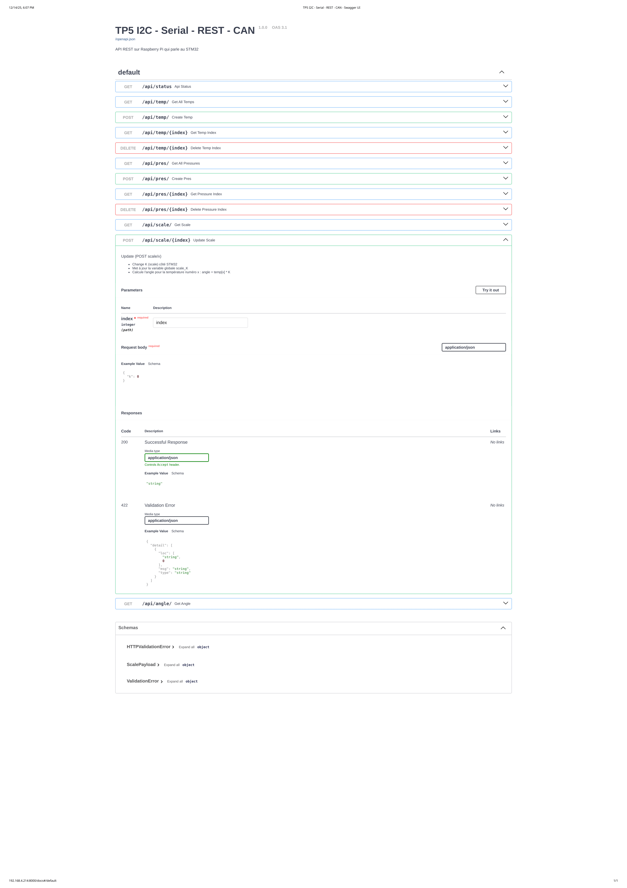
---
## 8. Conclusion
Cette série de TP a permis de mettre en œuvre une **architecture embarquée complète**, réaliste et modulaire. Elle combine des bus de terrain (I²C, CAN), une communication inter-cartes (UART) et des technologies réseau modernes (API REST). Le projet respecte strictement le sujet ENSEA et constitue une excellente base pratique pour la conception d'applications **IoT industrielles**.
!