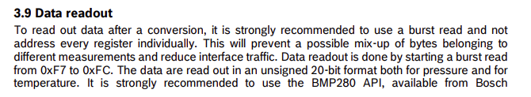
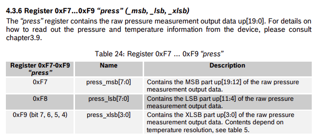

# TP1 – Bus I²C  

## 2.1 Capteur BMP280
###  Objectif  
Identifier et utiliser les registres essentiels du capteur BMP280 en mode I²C, lire les données brutes pression/température et appliquer les formules de compensation officielles de Bosch.

---

##  1. Adresses I²C possibles  
Le BMP280 propose deux adresses I²C selon la broche SDO :

| SDO | Adresse I²C (7 bits) |
|-----|-----------------------|
| GND | 0x76 |
| VDDIO | 0x77 |

Voir datasheet BMP280 section I²C Interface, page 28 : [BMP280_Datasheet.pdf](./docs/BMP280_Datasheet.pdf)


---

## 2. Registre d’identification  
- Adresse du registre : **0xD0**  
- Valeur retournée : **0x58**

Voir datasheet BMP280 section Register Description, page 24 : [BMP280_Datasheet.pdf](./docs/BMP280_Datasheet.pdf)


---

## 3. Configuration du mode NORMAL  
Le registre **CTRL_MEAS (0xF4)** contrôle :
- **osrs_t** (bits 7:5) : oversampling température  
- **osrs_p** (bits 4:2) : oversampling pression  
- **mode** (bits 1:0)

Mode Normal → **mode = 11**

Configuration utilisée dans le TP :  
- osrs_t = `010`  
- osrs_p = `101`  
- mode   = `11`

→ Valeur à écrire dans **0xF4 = 0x57**

Voir datasheet BMP280 section Power modes, page 15 : [BMP280_Datasheet.pdf](./docs/BMP280_Datasheet.pdf)


---

## 4. Registres d’étalonnage (calibration)  
Les coefficients dig_T1..T3 et dig_P1..P9 sont stockés dans :

- **0x88 → 0xA1**

Liste officielle :

| Adresse | Nom |
|---------|------|
| 0x88–0x89 | dig_T1 |
| 0x8A–0x8B | dig_T2 |
| 0x8C–0x8D | dig_T3 |
| 0x8E–0x8F | dig_P1 |
| 0x90–0x9F | dig_P2 à dig_P9 |
  

Voir datasheet BMP280 section Memory map, page 24 & Trimming parameter readout, page 21: [BMP280_Datasheet.pdf](./docs/BMP280_Datasheet.pdf)


---

## 5. Registres de température (20 bits)

| Registre | Description |
|----------|-------------|
| 0xFA | temp_msb (bits 19:12) |
| 0xFB | temp_lsb (bits 11:4) |
| 0xFC | temp_xlsb (bits 3:0) |

Format : **20 bits non signés**

Voir datasheet BMP280 section Register 0xFA–0xFC, page 27 & section Data readout, page 19 : [BMP280_Datasheet.pdf](./docs/BMP280_Datasheet.pdf)




---

## 6. Registres de pression (20 bits)

| Registre | Description |
|----------|-------------|
| 0xF7 | press_msb |
| 0xF8 | press_lsb |
| 0xF9 | press_xlsb |

Format : **20 bits non signés**

Voir datasheet BMP280 section Register 0xF7–0xF9, page 26 & section Data readout, page 19 : [BMP280_Datasheet.pdf](./docs/BMP280_Datasheet.pdf)




---

## 7. Fonctions de compensation (format int32 / int64)

Bosch fournit les fonctions officielles :


**Température compensée (int32):**
```c
BMP280_S32_t bmp280_compensate_T_int32(BMP280_S32_t adc_T);
```
**Pression compensée (int64) ou (int32):**
```c
BMP280_U32_t bmp280_compensate_P_int64(BMP280_S32_t adc_P);
```


Les formules officielles sont dans la datasheet, section 3.11.3.

Voir datasheet BMP280 section Compensation formula, page 21 : [BMP280_Datasheet.pdf](./docs/BMP280_Datasheet.pdf)


